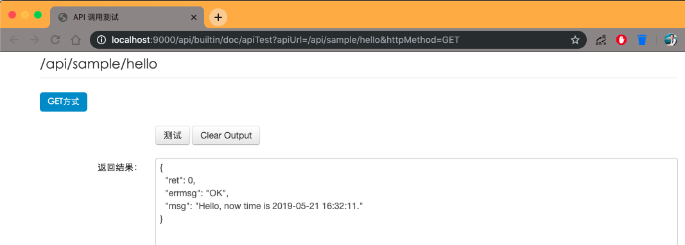

# 新建项目 
---

## 安装构建依赖
* 安装好 **subversion**, 获取项目工程模板时会用到
* 安装好 **JDK 8**
* 安装好 **Gradle 5.x**
* IDE推荐使用 **IntelliJ IDEA**, [下载页面](https://www.jetbrains.com/idea/download/)  
> Community社区版功能足以, 有钱的同学可以买 **Ultimate** 版

## 创建项目
现在假定我们创建一个叫 **Hello** 的应用.

* 从 [LoveInShenZhen/ProjectTemplates](https://github.com/LoveInShenZhen/ProjectTemplates) 获取工程模板.

```bash
svn export https://github.com/LoveInShenZhen/ProjectTemplates.git/trunk/vertx-web-simple Hello
```

## 项目目录结构
项目工程的目录结构如下, 具体的目录和配置文件的说明, 请阅读 _**ToDo**_ 文档.
```
Hello
├── build
│   ├── generated
│   │   └── source
│   │       └── kaptKotlin
│   │           ├── main
│   │           └── test
│   └── tmp
│       └── kapt3
│           ├── incrementalData
│           │   ├── main
│           │   └── test
│           └── stubs
│               ├── main
│               └── test
├── build.gradle.kts
├── conf
│   ├── application.conf
│   ├── logback.xml
│   ├── route
│   ├── vertx-default-jul-logging.properties
│   └── vertxOptions.json
├── gradle
│   └── wrapper
│       ├── gradle-wrapper.jar
│       └── gradle-wrapper.properties
├── gradlew
├── gradlew.bat
├── settings.gradle.kts
└── src
    └── main
        ├── kotlin
        │   ├── com
        │   │   └── api
        │   │       └── server
        │   │           ├── ApiServer.kt
        │   │           └── controller
        │   │               ├── Sample.kt
        │   │               └── reply
        │   │                   └── HelloReply.kt
        │   └── models
        │       └── User.kt
        └── resources
            └── ebean.mf

27 directories, 16 files
```

## 运行项目

```bash
# 进入到工程目录
cd Hello
# 构建项目, gradle自动下载依赖项
gradle build
# 运行项目
gradle run
```

## 查看自动生成的API接口测试页面
* 默认使用 9000 端口, 可以在 conf/application.conf 里进行配置
* 点击 [http://localhost:9000/api/builtin/doc/apiIndex](http://localhost:9000/api/builtin/doc/apiIndex) 查看自动生成的APi测试页面

* API接口文档列表页面
> 

* API接口测试页面
> 

## 查看自动生成的API接口文档
* 点击 [http://localhost:9000/api/builtin/doc/apiDocHtml](http://localhost:9000/api/builtin/doc/apiDocHtml) 查看自动生成的API接口文档
* API接口文档页面
> 
