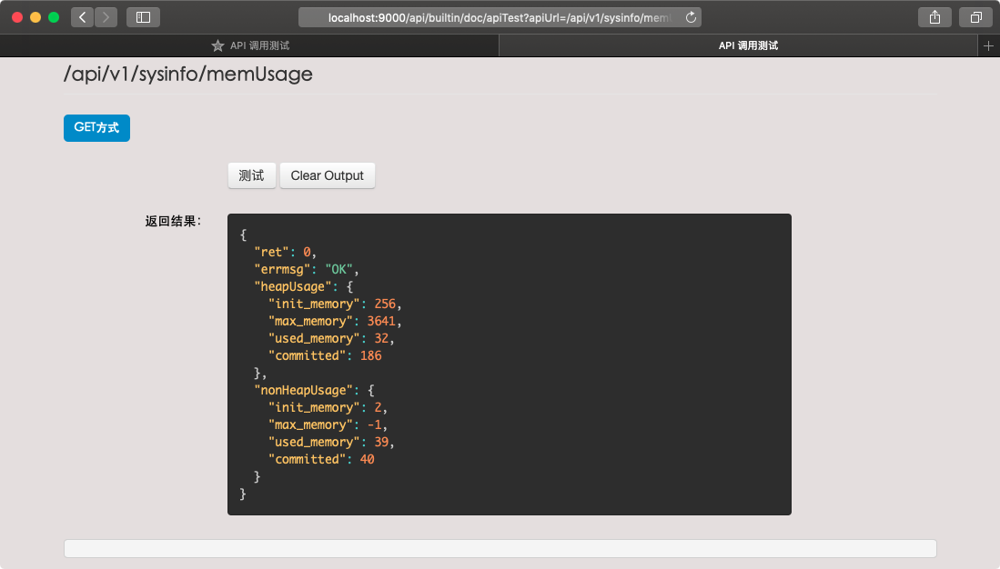
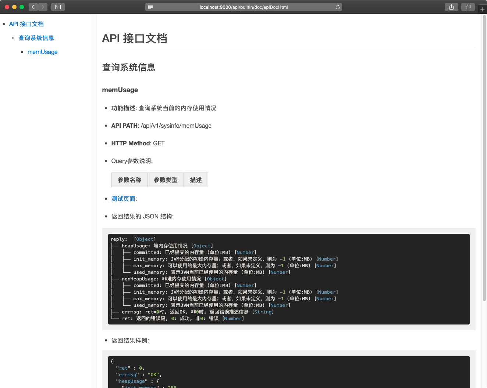

## 概述

我们会新增几个API接口, 下文会记录整个过程.

---

### TASK: _新增接口,用于查询内存使用情况_
* 在 com.api.server.controller 包下新建一个 package, 名称为: sysinfo
* 在包 **com.api.server.controller.sysinfo** 下, 新建一个controller class: **SysInfo**
* 所有的控制器类都是从 **sz.scaffold.controller.ApiController** 继承下来的子类
* 如下所示, 在控制器类和方法的定义上面, 添加标注 **@Comment("注释说明")**, 系统会根据这些 **@Comment** 自动生成 API接口文档 和 API测试页面

```kotlin
package com.api.server.controller.sysinfo

import sz.scaffold.annotations.Comment
import sz.scaffold.controller.ApiController


@Comment("查询系统信息")
class SysInfo : ApiController() {
    // todo: 等待添加控制器方法
}
```

* 通常, 我们会在控制器所在的包下面, 创建一个叫做 **reply** 的包, 控制器方法返回的 reply 的class会在 **reply** 的包下面定义. 这个只是编码习惯, 非强制性.
* 定义查询内存使用情况这个方法所需要返回的reply类
> * 先定义用来描述内存使用信息的一个**数据类**: _MemoryUsageInfo_
> * 在字段的定义上, 添加 **@Comment** 标注, 填上描述该字段的注释. 用来自动生成 API接口文档

```kotlin
package com.api.server.controller.sysinfo.reply

import sz.scaffold.annotations.Comment
import java.lang.management.MemoryUsage

class MemoryUsageInfo {

    @Comment("JVM分配的初始内存量；或者，如果未定义，则为 -1 (单位:MB)")
    var init_memory: Long = -1

    @Comment("可以使用的最大内存量；或者，如果未定义，则为 -1 (单位:MB)")
    var max_memory: Long = -1

    @Comment("表示JVM当前已经使用的内存量 (单位:MB)")
    var used_memory: Long = 0

    @Comment("已经提交的内存量 (单位:MB)")
    var committed: Long = 0

    fun loadFrom(usage: MemoryUsage): MemoryUsageInfo {
        init_memory = convertToMB(usage.init)
        max_memory = convertToMB(usage.max)
        used_memory = convertToMB(usage.used)
        committed  = convertToMB(usage.committed)
        return this
    }

    private fun convertToMB(size: Long): Long {
        if (size < 0) {
            return size
        } else {
            return size / 1024 / 1024
        }
    }
}
```

> * 定义对应的 **Reply类**:  _MemoryUsageReply_
> * 所有的 **Reply类** 都是从 **sz.scaffold.controller.reply.ReplyBase** 继承下来

```kotlin
package com.api.server.controller.sysinfo.replys

import sz.scaffold.annotations.Comment
import sz.scaffold.controller.reply.ReplyBase
import java.lang.management.ManagementFactory


class MemoryUsageReply : ReplyBase() {

    @Comment("堆内存使用情况")
    var heapUsage = MemoryUsageInfo()

    @Comment("非堆内存使用情况")
    var nonHeapUsage = MemoryUsageInfo()

    fun load() {
        val mxBean = ManagementFactory.getMemoryMXBean()
        heapUsage.loadFrom(mxBean.heapMemoryUsage)
        nonHeapUsage.loadFrom(mxBean.nonHeapMemoryUsage)
    }

    override fun SampleData() {
        this.load()
    }
}
```

* 定义控制器类**SysInfo**里添加控制器方法: **fun memUsage() : MemoryUsageReply**

```kotlin
package com.api.server.controller.sysinfo

import com.api.server.controller.sysinfo.reply.EnvironmentReply
import com.api.server.controller.sysinfo.reply.MemoryUsageReply
import com.api.server.controller.sysinfo.reply.PropertiesReply
import sz.scaffold.annotations.Comment
import sz.scaffold.controller.ApiController


@Comment("查询系统信息")
class SysInfo : ApiController() {

    @Comment("查询系统当前的内存使用情况")
    fun memUsage() : MemoryUsageReply {
        val reply = MemoryUsageReply()
        reply.load()
        return reply
    }
}
```

* 设置控制器方法 **fun memUsage()** 对应的路由
> * 打开路由配置文: **conf/route**, 添加一条路由
> * 路由设置分成3个部分, 从左到右, 中间用**空格**或者**tab**隔开, 依次是:
> * * Http Method: 可以是 **GET**,**POST**,**HEAD**, (注:大写)
> * * Http Path: http url中的path路径
> * * 控制器类的全名 + 控制器方铭名称, 用 "**.**" 连接起来

```
GET     /api/v1/sysinfo/memUsage        com.api.server.controller.sysinfo.SysInfo.memUsage
```

* 编译构建

```
# 进入到工程目录
cd Hello
# 构建项目, gradle自动下载依赖项
gradle build
# 运行项目
gradle run
```

> 

* 打开api列表页面 [http://localhost:9000/api/builtin/doc/apiIndex](http://localhost:9000/api/builtin/doc/apiIndex)

> 

* 打开 **memUsage** 的接口测试页面, 点击 **测试** 按钮进行测试

> 

* 打开api接口文档页面 [http://localhost:9000/api/builtin/doc/apiDocHtml](http://localhost:9000/api/builtin/doc/apiDocHtml)

> 

* 可以看到, **sz框架** 已经根据 **@Comment** 标注的信息, 自动帮我们生成了对应的api接口文档和api测试页面

---
## 完整样例代码
与上面的操作类似, 在 SysInfo 控制器类里, 继续新增了2个api接口方法

```kotlin
    @Comment("查询系统当前运行环境下的环境变量")
    fun environments() : EnvironmentReply {
        val reply = EnvironmentReply()
        reply.load()

        return reply
    }

    @Comment("查询系统当前运行环境下的属性列表")
    fun sysProperties() : PropertiesReply {
        val reply = PropertiesReply()
        reply.load()
        return reply
    }
```

* 完整代码请移步: [https://github.com/LoveInShenZhen/ProjectTemplates/tree/master/samples/QuickStart](https://github.com/LoveInShenZhen/ProjectTemplates/tree/master/samples/QuickStart)

```bash
# 下载代码请执行如下命令
svn export https://github.com/LoveInShenZhen/ProjectTemplates.git/trunk/samples/QuickStart QuickStart
```

---
## 小结一下开发流程
1. 需求分析, 拆分成若干个API功能接口
1. 确定每个API接口的输入参数是什么, 输出的JSON结构是什么
1. 根据输出的JSON结构层次, 定义对应的Reply类, 为每个字段添加 **@Comment** 注释信息
1. 选择已有的控制器类,或者新建一个控制器类 (注: 同一类相关业务逻辑功能的api接口, 一般都放在同一个控制器类里)
1. 定义api接口的控制器方法, 在方法上添加 **@Comment** 注释信息
1. 在api接口的控制器方法的参数列表里, 为每一个参数添加 **@Comment** 注释信息
1. 实现api接口方法的业务逻辑功能, 编码测试
1. 部署到测试服务器, 提交给前端开发人员.(前端开发人员可以实时查看测试服务器上最新的在线文档和在线测试页面)

